# VS Code Extension: Insert Sequences (InsertSeq formarly Insertnums)

Insert Sequences is a small VS Code extension that helps you generate and insert various kinds of sequences into one or more cursors. It supports numeric sequences, alphabetic sequences, dates, user-defined or predefined lists, and inline JavaScript expressions. The syntax is compact and powerful, allowing repetition, stepping, frequency control, custom formats, stop expressions, and more.

## All examples in this document are shown as GIF file.

### Multi-cursor example (5 cursors)

With five empty cursors, start `insertseq` and you will see a preview of numbers 1 to 5 (the default start is 1).

If you type `3`, the preview updates to 3–7. Pressing Enter inserts those numbers:

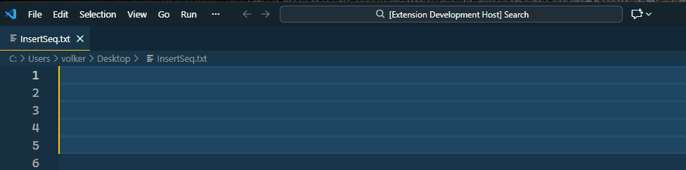

### Change the step

Use `:<number>` or `step:<number>` to set the increment. The `step:` form requires a word boundary (space or comma) before it (for example, `10 step:2` works; `10step:2` does not).

Input: `10:2` (or `10 step:2`) with 5 selections → output:

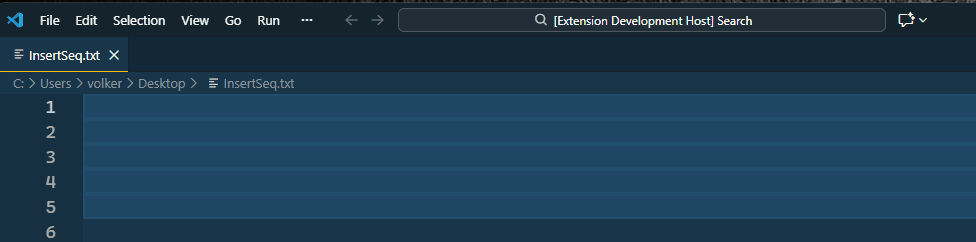

### Repeat sequence after a fixed number of insertions

Use `#` or `rep:` / `repeat:` / `repetition:` to define the cycle length.

Input: `1#5` with 10 selections → output:

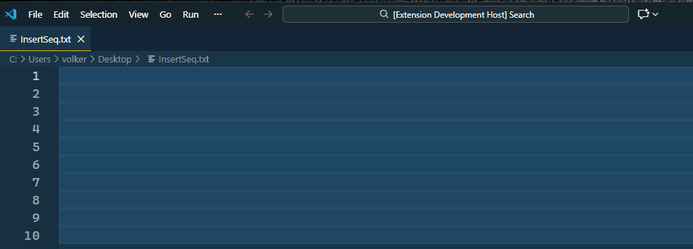

### Repeat each value multiple times (frequency)

Use `*` or `freq:` / `frequency:` to repeat each logical value several times.

Input: `1 freq:2` with 10 selections → output:

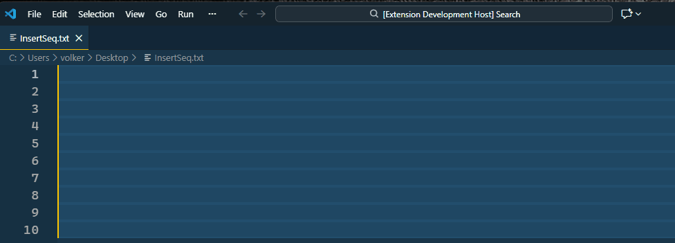

### Startover (overall cycle length)

Use `##` or `startover:` / `startagain:` to restart the entire emitted stream after N emitted items.

Input: `1 rep:2 freq:3 startover:7` (short: `1#2*3##7`) with 13 selections → output:

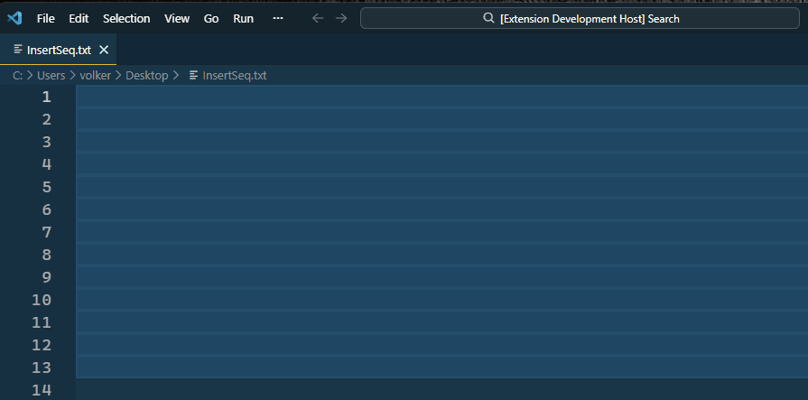

### Formatting numbers

Formatting uses d3-format style. Example: zero-pad to width 3 with `~03d`.

Input: `1~03d` with 5 selections → output:

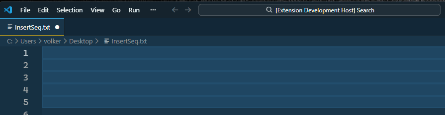

### Stop expression

Use `@` or `stopif:` / `stopexpr:` / `stopexpression:` to stop insertion based on a boolean expression. Use placeholders such as `i` for the current index (0-based).

Input: `1 stopif:(i>5)` with many selections will stop when `i > 5` (when the number would be 7).

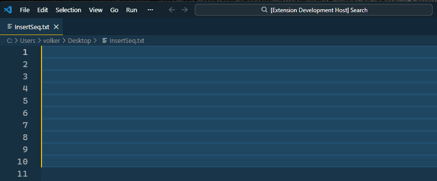

During preview no new lines are inserted; the preview shows future insertions on the last selected line.

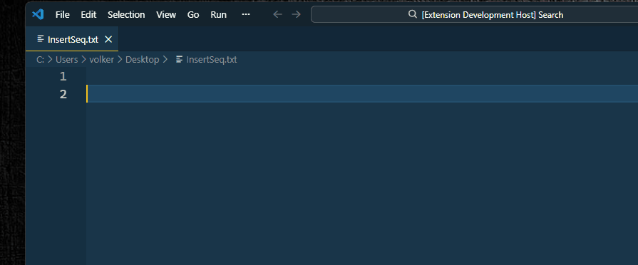

### Alphabetic sequences

Alpha sequences use the configured alphabet (default `a`–`z`). All characters in the alphabet must be unique. If you have not defined a custom alphabet, the extension uses the default a–z alphabet (case handled by options).

Input: `a` with 5 selections → output:

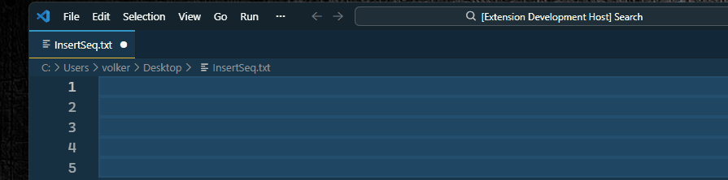

### Formatting alphabetic sequences

String formatting supports padding and alignment. Example: right-align in width 10 with `~>10`.

Input: `a~>10` with 5 selections → output:

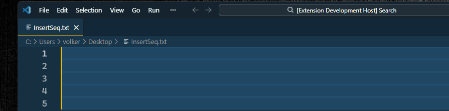

Use `~w` to enable wrap behavior (for example, `z~w` yields `z, a, b, ...` if configured).

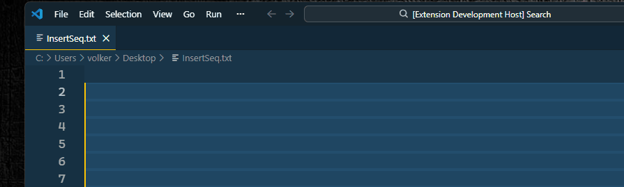

### Date sequences

Date sequences start with `%` followed by a date (for example, `yyyy-mm-dd`) or a quoted date string. Steps support days (default), weeks, months, or years. You can specify a language for formatting with `lang:`.

Input: `%2025-03-02:1w~lang:de` with 5 selections → output:

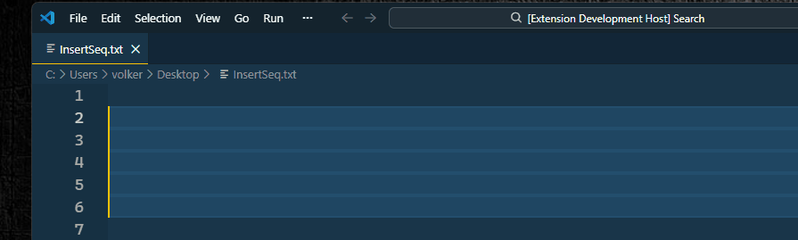

### Expressions

Use the pipe `|` to create a sequence from an inline JavaScript expression. The expression is evaluated for each emission; parentheses or quotes are recommended for clarity.

Input: `|(i>0?p * 2:1)` with 5 selections → output:

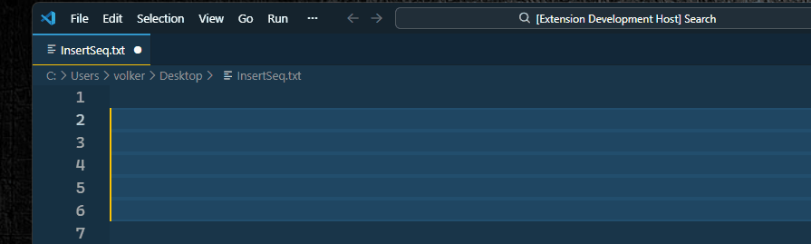

### Inline lists (Own sequences)

Provide a list inline using square brackets. Items are treated as a circular list.

Input: `[Jan, Feb,Mar]` with 5 selections → output:


### Predefined lists

Predefined lists come from your configuration setting (`insertseq.mysequences`). Use the `;` prefix to reference them.

Given configuration:

```json
"insertseq.mysequences": [
  ["Jan","Feb","Mär","Apr","Mai","Jun","Jul","Aug","Sep","Okt","Nov","Dez"],
  ["foo","bar","foz"]
]
```

Input: `;Mär` with 5 selections → output:

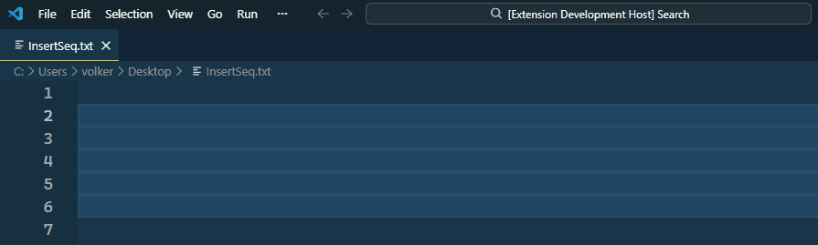

### Predefined functions

Predefined functions come from your configuration settings (`insertseq.myfunctions`). Use `=` to reference them, followed by the number (1-based) of the function you want to use.

Given configuration:

```json
"insertseq.myfunctions": [
	"(i, start=1, step=1) => start + (i ** step)",
	"(i) => Math.PI.toString().split('').splice(i,1)"
]
```

Input: `=2` with 5 selections → output:


